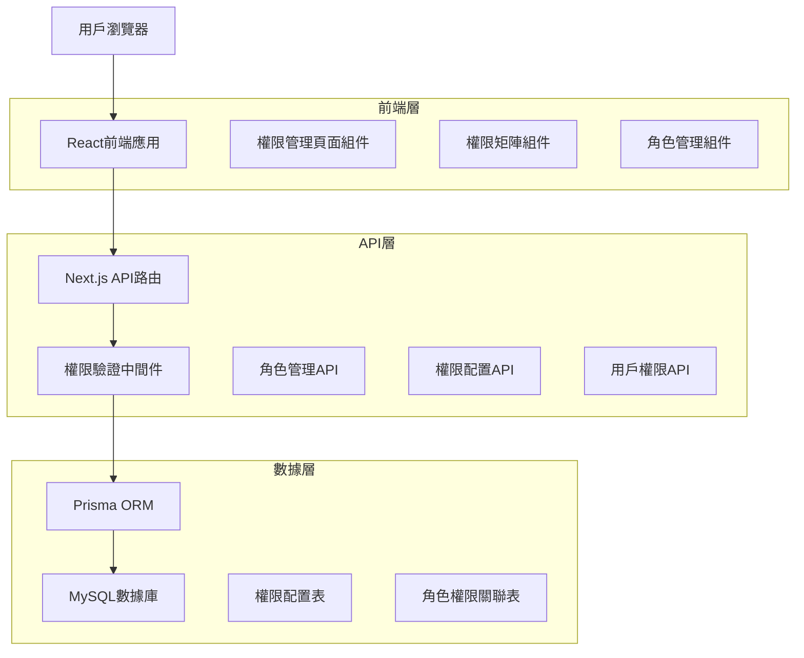
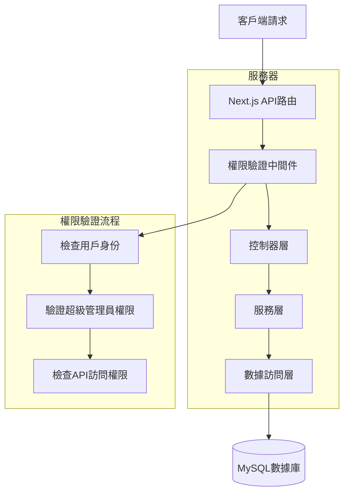
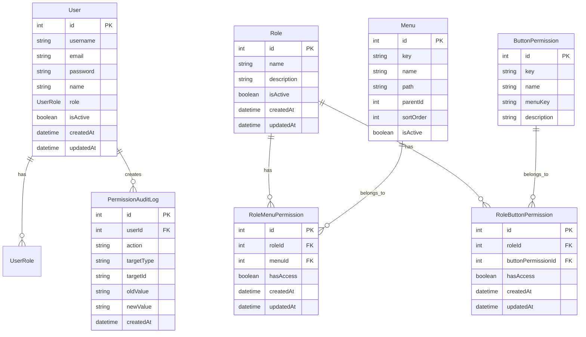

# RBAC權限管理系統技術架構文檔

## 1. 架構設計



## 2. 技術描述

* 前端：React\@18 + Next.js\@14 + TypeScript + Ant Design + Tailwind CSS

* 後端：Next.js API Routes + NextAuth.js

* 數據庫：MySQL + Prisma ORM

* 權限驗證：基於現有的auth-utils.ts擴展

* 狀態管理：React Query (TanStack Query)

## 3. 路由定義

| 路由                                       | 用途                   |
| ---------------------------------------- | -------------------- |
| /project/\[id]/admin/permissions         | 權限管理主頁，顯示權限概覽和快速配置入口 |
| /project/\[id]/admin/permissions/roles   | 角色管理頁面，管理系統角色和角色權限   |
| /project/\[id]/admin/permissions/menus   | 菜單權限配置頁面，配置角色的菜單訪問權限 |
| /project/\[id]/admin/permissions/buttons | 按鈕權限配置頁面，配置角色的操作權限   |
| /project/\[id]/admin/permissions/users   | 用戶權限分配頁面，為用戶分配角色     |
| /project/\[id]/admin/permissions/audit   | 權限審計日誌頁面，查看權限變更記錄    |

## 4. API定義

### 4.1 核心API

**角色管理相關**

```
GET /api/admin/roles
```

獲取所有角色列表

Response:

| 參數名稱    | 參數類型    | 描述   |
| ------- | ------- | ---- |
| success | boolean | 請求狀態 |
| data    | Role\[] | 角色列表 |

```
POST /api/admin/roles
```

創建新角色

Request:

| 參數名稱        | 參數類型    | 是否必需  | 描述   |
| ----------- | ------- | ----- | ---- |
| name        | string  | true  | 角色名稱 |
| description | string  | false | 角色描述 |
| isActive    | boolean | false | 是否啟用 |

**權限配置相關**

```
GET /api/admin/permissions/menus
```

獲取菜單權限配置

Response:

| 參數名稱    | 參數類型              | 描述     |
| ------- | ----------------- | ------ |
| success | boolean           | 請求狀態   |
| data    | MenuPermission\[] | 菜單權限列表 |

```
POST /api/admin/permissions/menus
```

更新菜單權限配置

Request:

| 參數名稱            | 參數類型                    | 是否必需 | 描述     |
| --------------- | ----------------------- | ---- | ------ |
| roleId          | number                  | true | 角色ID   |
| menuPermissions | MenuPermissionConfig\[] | true | 菜單權限配置 |

**用戶權限相關**

```
GET /api/admin/users/[id]/permissions
```

獲取用戶權限詳情

Response:

| 參數名稱    | 參數類型                 | 描述     |
| ------- | -------------------- | ------ |
| success | boolean              | 請求狀態   |
| data    | UserPermissionDetail | 用戶權限詳情 |

示例：

```json
{
  "roleId": 1,
  "menuPermissions": [
    {
      "menuKey": "sales-control",
      "hasAccess": true,
      "children": [
        {
          "menuKey": "sales-overview",
          "hasAccess": true
        }
      ]
    }
  ]
}
```

## 5. 服務器架構圖



## 6. 數據模型

### 6.1 數據模型定義



### 6.2 數據定義語言

**角色表 (roles)**

```sql
-- 創建角色表
CREATE TABLE roles (
    id INT PRIMARY KEY AUTO_INCREMENT,
    name VARCHAR(50) UNIQUE NOT NULL COMMENT '角色名稱',
    description TEXT COMMENT '角色描述',
    is_active BOOLEAN DEFAULT TRUE COMMENT '是否啟用',
    created_at TIMESTAMP DEFAULT CURRENT_TIMESTAMP,
    updated_at TIMESTAMP DEFAULT CURRENT_TIMESTAMP ON UPDATE CURRENT_TIMESTAMP
);

-- 創建索引
CREATE INDEX idx_roles_name ON roles(name);
CREATE INDEX idx_roles_is_active ON roles(is_active);
```

**菜單表 (menus)**

```sql
-- 創建菜單表
CREATE TABLE menus (
    id INT PRIMARY KEY AUTO_INCREMENT,
    menu_key VARCHAR(100) UNIQUE NOT NULL COMMENT '菜單唯一標識',
    name VARCHAR(100) NOT NULL COMMENT '菜單名稱',
    path VARCHAR(255) COMMENT '菜單路徑',
    parent_id INT COMMENT '父級菜單ID',
    sort_order INT DEFAULT 0 COMMENT '排序順序',
    is_active BOOLEAN DEFAULT TRUE COMMENT '是否啟用',
    created_at TIMESTAMP DEFAULT CURRENT_TIMESTAMP,
    updated_at TIMESTAMP DEFAULT CURRENT_TIMESTAMP ON UPDATE CURRENT_TIMESTAMP,
    FOREIGN KEY (parent_id) REFERENCES menus(id) ON DELETE SET NULL
);

-- 創建索引
CREATE INDEX idx_menus_key ON menus(menu_key);
CREATE INDEX idx_menus_parent_id ON menus(parent_id);
```

**角色菜單權限表 (role\_menu\_permissions)**

```sql
-- 創建角色菜單權限表
CREATE TABLE role_menu_permissions (
    id INT PRIMARY KEY AUTO_INCREMENT,
    role_id INT NOT NULL COMMENT '角色ID',
    menu_id INT NOT NULL COMMENT '菜單ID',
    has_access BOOLEAN DEFAULT FALSE COMMENT '是否有訪問權限',
    created_at TIMESTAMP DEFAULT CURRENT_TIMESTAMP,
    updated_at TIMESTAMP DEFAULT CURRENT_TIMESTAMP ON UPDATE CURRENT_TIMESTAMP,
    UNIQUE KEY uk_role_menu (role_id, menu_id),
    FOREIGN KEY (role_id) REFERENCES roles(id) ON DELETE CASCADE,
    FOREIGN KEY (menu_id) REFERENCES menus(id) ON DELETE CASCADE
);

-- 創建索引
CREATE INDEX idx_role_menu_permissions_role_id ON role_menu_permissions(role_id);
CREATE INDEX idx_role_menu_permissions_menu_id ON role_menu_permissions(menu_id);
```

**按鈕權限表 (button\_permissions)**

```sql
-- 創建按鈕權限表
CREATE TABLE button_permissions (
    id INT PRIMARY KEY AUTO_INCREMENT,
    permission_key VARCHAR(100) UNIQUE NOT NULL COMMENT '權限唯一標識',
    name VARCHAR(100) NOT NULL COMMENT '權限名稱',
    menu_key VARCHAR(100) NOT NULL COMMENT '所屬菜單標識',
    description TEXT COMMENT '權限描述',
    created_at TIMESTAMP DEFAULT CURRENT_TIMESTAMP,
    updated_at TIMESTAMP DEFAULT CURRENT_TIMESTAMP ON UPDATE CURRENT_TIMESTAMP
);

-- 創建索引
CREATE INDEX idx_button_permissions_key ON button_permissions(permission_key);
CREATE INDEX idx_button_permissions_menu_key ON button_permissions(menu_key);
```

**角色按鈕權限表 (role\_button\_permissions)**

```sql
-- 創建角色按鈕權限表
CREATE TABLE role_button_permissions (
    id INT PRIMARY KEY AUTO_INCREMENT,
    role_id INT NOT NULL COMMENT '角色ID',
    button_permission_id INT NOT NULL COMMENT '按鈕權限ID',
    has_access BOOLEAN DEFAULT FALSE COMMENT '是否有操作權限',
    created_at TIMESTAMP DEFAULT CURRENT_TIMESTAMP,
    updated_at TIMESTAMP DEFAULT CURRENT_TIMESTAMP ON UPDATE CURRENT_TIMESTAMP,
    UNIQUE KEY uk_role_button (role_id, button_permission_id),
    FOREIGN KEY (role_id) REFERENCES roles(id) ON DELETE CASCADE,
    FOREIGN KEY (button_permission_id) REFERENCES button_permissions(id) ON DELETE CASCADE
);

-- 創建索引
CREATE INDEX idx_role_button_permissions_role_id ON role_button_permissions(role_id);
CREATE INDEX idx_role_button_permissions_button_id ON role_button_permissions(button_permission_id);
```

**權限審計日誌表 (permission\_audit\_logs)**

```sql
-- 創建權限審計日誌表
CREATE TABLE permission_audit_logs (
    id INT PRIMARY KEY AUTO_INCREMENT,
    user_id INT NOT NULL COMMENT '操作用戶ID',
    action VARCHAR(50) NOT NULL COMMENT '操作類型',
    target_type VARCHAR(50) NOT NULL COMMENT '目標類型',
    target_id VARCHAR(100) NOT NULL COMMENT '目標ID',
    old_value TEXT COMMENT '舊值',
    new_value TEXT COMMENT '新值',
    ip_address VARCHAR(45) COMMENT 'IP地址',
    user_agent TEXT COMMENT '用戶代理',
    created_at TIMESTAMP DEFAULT CURRENT_TIMESTAMP,
    FOREIGN KEY (user_id) REFERENCES user(id) ON DELETE CASCADE
);

-- 創建索引
CREATE INDEX idx_permission_audit_logs_user_id ON permission_audit_logs(user_id);
CREATE INDEX idx_permission_audit_logs_action ON permission_audit_logs(action);
CREATE INDEX idx_permission_audit_logs_created_at ON permission_audit_logs(created_at DESC);
```

**初始化數據**

```sql
-- 插入系統菜單數據
INSERT INTO menus (menu_key, name, path, parent_id, sort_order) VALUES
('statistics', '數據統計', '/project/[id]/statistics', NULL, 1),
('sales-control-group', '銷控總表', NULL, NULL, 2),
('sales-control', '銷控管理', '/project/[id]/sales-control', 2, 1),
('sales-overview', '銷售概況', '/project/[id]/sales-overview', 2, 2),
('parking', '停車位總表', '/project/[id]/parking', 2, 3),
('appointments', '客戶預約', '/project/[id]/appointments', NULL, 3),
('customers', '已購客名單', '/project/[id]/purchased-customers', NULL, 4),
('sales-personnel', '銷售人員管理', '/project/[id]/sales-personnel', NULL, 5),
('questionnaire', '訪客問卷', '/project/[id]/visitor-questionnaire', NULL, 6),
('financial', '財務系統', NULL, NULL, 7),
('financial-overview', '財務總覽', '/project/[id]/financial', 10, 1),
('budget', '預算規劃', '/project/[id]/budget', 10, 2),
('expenses', '支出管理', '/project/[id]/expenses', 10, 3),
('commission', '請傭列表', '/project/[id]/commission', 10, 4),
('handover', '點交屋管理', '/project/[id]/handover', NULL, 8),
('withdrawal', '退戶記錄', '/project/[id]/withdrawal', NULL, 9),
('admin-permissions', '權限管理', '/project/[id]/admin/permissions', NULL, 10);

-- 插入按鈕權限數據
INSERT INTO button_permissions (permission_key, name, menu_key, description) VALUES
('sales-control:create', '新增銷控', 'sales-control', '創建新的銷控記錄'),
('sales-control:edit', '編輯銷控', 'sales-control', '編輯現有銷控記錄'),
('sales-control:delete', '刪除銷控', 'sales-control', '刪除銷控記錄'),
('sales-control:export', '導出銷控', 'sales-control', '導出銷控數據'),
('customers:create', '新增客戶', 'customers', '創建新客戶記錄'),
('customers:edit', '編輯客戶', 'customers', '編輯客戶信息'),
('customers:delete', '刪除客戶', 'customers', '刪除客戶記錄'),
('financial:view-sensitive', '查看敏感財務數據', 'financial-overview', '查看敏感的財務信息'),
('admin-permissions:manage', '管理權限', 'admin-permissions', '管理系統權限配置');
```

