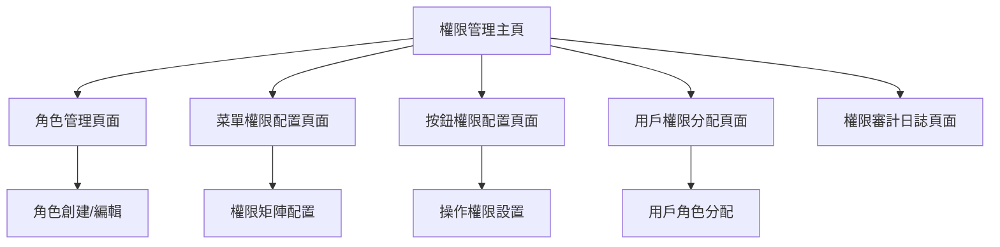

# RBAC權限管理系統需求文檔

## 1. 產品概述

本系統是房地產銷控管理系統的權限管理模塊，提供基於角色的訪問控制（RBAC）功能。系統允許超級管理員配置不同角色的菜單訪問權限和按鈕操作權限，實現細粒度的權限控制和安全管理。

- 解決問題：統一管理系統中各角色的權限分配，確保數據安全和操作規範
- 目標用戶：超級管理員進行權限配置，其他角色按權限使用系統功能
- 產品價值：提升系統安全性，規範用戶操作流程，支持企業級權限管理需求

## 2. 核心功能

### 2.1 用戶角色

| 角色 | 註冊方法 | 核心權限 |
|------|----------|----------|
| 超級管理員 | 系統預設賬戶 | 完整權限管理功能，可配置所有角色權限 |
| 其他角色 | 超級管理員分配 | 根據權限配置訪問對應功能模塊 |

### 2.2 功能模塊

本RBAC權限管理系統包含以下主要頁面：
1. **權限管理主頁**：權限概覽、快速配置入口、權限統計儀表板
2. **角色管理頁面**：角色列表、角色創建編輯、角色權限總覽
3. **菜單權限配置頁面**：菜單樹狀結構、權限矩陣配置、批量權限設置
4. **按鈕權限配置頁面**：按鈕權限列表、細粒度權限控制、操作權限分配
5. **用戶權限分配頁面**：用戶列表、角色分配、個人權限查看
6. **權限審計日誌頁面**：權限變更記錄、操作日誌、安全審計

### 2.3 頁面詳情

| 頁面名稱 | 模塊名稱 | 功能描述 |
|----------|----------|----------|
| 權限管理主頁 | 權限概覽儀表板 | 顯示系統權限統計、角色分佈、最近權限變更記錄 |
| 權限管理主頁 | 快速配置面板 | 提供常用權限配置快捷入口、權限模板應用 |
| 角色管理頁面 | 角色列表管理 | 創建、編輯、刪除角色，設置角色描述和狀態 |
| 角色管理頁面 | 角色權限總覽 | 查看角色的完整權限清單，權限繼承關係 |
| 菜單權限配置頁面 | 菜單樹狀結構 | 展示系統菜單層級結構，支持展開收縮操作 |
| 菜單權限配置頁面 | 權限矩陣配置 | 角色與菜單的權限矩陣表格，支持批量勾選 |
| 菜單權限配置頁面 | 權限繼承設置 | 配置父級菜單權限對子級菜單的繼承規則 |
| 按鈕權限配置頁面 | 按鈕權限列表 | 管理頁面內按鈕的訪問權限，如新增、編輯、刪除等 |
| 按鈕權限配置頁面 | 操作權限分配 | 為不同角色分配具體的操作權限，支持自定義權限組合 |
| 用戶權限分配頁面 | 用戶角色管理 | 為用戶分配角色，支持多角色分配和角色切換 |
| 用戶權限分配頁面 | 個人權限查看 | 查看用戶的實際權限清單，包括繼承和直接分配的權限 |
| 權限審計日誌頁面 | 權限變更記錄 | 記錄所有權限配置變更，包括操作人、時間、變更內容 |
| 權限審計日誌頁面 | 安全審計報告 | 生成權限安全報告，識別權限風險和異常操作 |

## 3. 核心流程

**超級管理員權限配置流程：**
1. 登入系統 → 進入權限管理主頁
2. 選擇角色管理 → 創建或編輯角色
3. 配置菜單權限 → 在權限矩陣中勾選角色可訪問的菜單
4. 配置按鈕權限 → 設置角色在各頁面的操作權限
5. 分配用戶角色 → 為用戶指定角色
6. 審核權限配置 → 檢查權限設置的合理性
7. 保存並生效 → 權限配置立即生效

**普通用戶權限驗證流程：**
1. 用戶登入 → 系統驗證用戶身份和角色
2. 訪問菜單 → 系統檢查菜單訪問權限
3. 執行操作 → 系統驗證按鈕操作權限
4. 權限不足 → 顯示權限不足提示
5. 記錄日誌 → 記錄用戶操作和權限檢查結果

## 4. 用戶界面設計

### 4.1 設計風格

- 主色調：#1890ff（藍色系），輔助色：#52c41a（綠色）、#faad14（橙色）
- 按鈕樣式：圓角按鈕，主要操作使用實心按鈕，次要操作使用線框按鈕
- 字體：系統默認字體，標題使用16px，正文使用14px，輔助文字使用12px
- 佈局風格：卡片式佈局，頂部導航，左側菜單樹，主內容區域使用表格和表單
- 圖標風格：使用Ant Design圖標庫，統一的線性圖標風格

### 4.2 頁面設計概覽

| 頁面名稱 | 模塊名稱 | UI元素 |
|----------|----------|--------|
| 權限管理主頁 | 權限概覽儀表板 | 統計卡片、圓環圖、柱狀圖、最近操作列表，使用藍色主題 |
| 角色管理頁面 | 角色列表管理 | 數據表格、搜索框、新增按鈕、操作按鈕組，支持分頁和排序 |
| 菜單權限配置頁面 | 權限矩陣配置 | 樹形選擇器、權限矩陣表格、批量操作工具欄，支持展開收縮 |
| 按鈕權限配置頁面 | 操作權限設置 | 權限配置表單、開關組件、權限預覽面板，實時權限效果展示 |
| 用戶權限分配頁面 | 用戶角色管理 | 用戶列表、角色選擇器、權限詳情抽屜，支持批量角色分配 |
| 權限審計日誌頁面 | 權限變更記錄 | 時間軸組件、篩選器、導出按鈕、詳情彈窗，支持日期範圍查詢 |

### 4.3 響應式設計

系統採用桌面優先設計，支持平板設備適配。在小屏幕設備上，側邊菜單自動收縮為抽屜式導航，表格支持橫向滾動，確保權限配置功能在不同設備上的可用性。