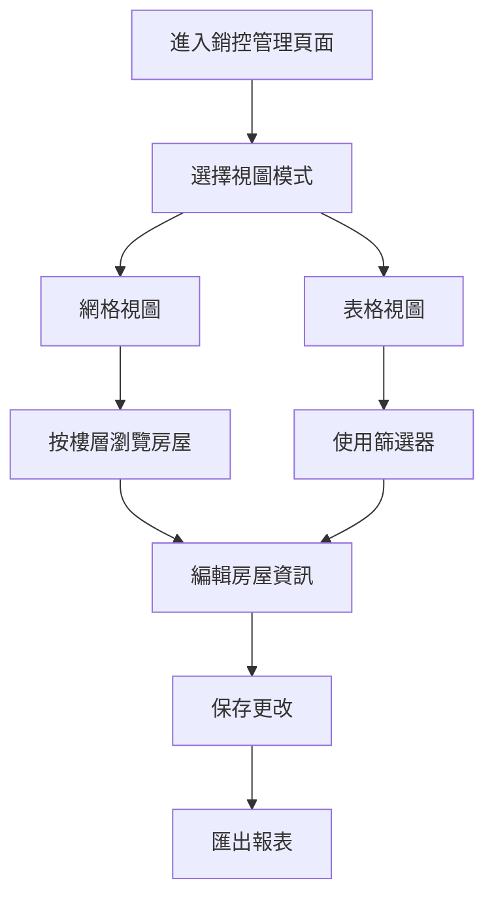

# 銷控管理頁面優化方案

## 1. 產品概述

銷控管理頁面是房地產銷售管理系統的核心功能模組，提供房屋銷售狀況的可視化管理和數據操作功能。當前頁面支援網格視圖和表格視圖兩種展示模式，具備篩選、匯入匯出、編輯等基礎功能。本優化方案旨在提升用戶體驗、改善視覺設計、增強功能性能，並優化操作流程。

## 2. 核心功能

### 2.1 用戶角色
| 角色 | 權限範圍 | 核心功能 |
|------|----------|----------|
| 銷售經理 | 完整管理權限 | 查看所有數據、編輯房屋資訊、管理銷售人員分配 |
| 銷售人員 | 限制性權限 | 查看分配房屋、更新銷售狀況、客戶資訊管理 |
| 財務人員 | 財務相關權限 | 查看價格資訊、匯出財務報表、審核交易記錄 |

### 2.2 功能模組

當前銷控管理頁面包含以下核心功能：

1. **雙視圖展示**：網格視圖展示房屋卡片，表格視圖提供詳細數據列表
2. **數據篩選**：支援按棟別、樓層、銷售狀況、銷售人員等條件篩選
3. **匯入匯出**：Excel/CSV格式的數據匯入匯出功能
4. **編輯管理**：房屋資訊編輯、銷售狀況更新、退戶處理
5. **欄位設定**：表格視圖的欄位顯示自定義

### 2.3 頁面詳情

| 頁面名稱 | 模組名稱 | 功能描述 |
|----------|----------|----------|
| 銷控管理主頁 | 頁面標題區 | 顯示頁面標題、視圖切換標籤、統計資訊 |
| 銷控管理主頁 | 工具欄區域 | 匯入匯出按鈕、篩選器、搜尋框、欄位設定 |
| 銷控管理主頁 | 網格視圖 | 按樓層分組的房屋卡片展示，包含詳細資訊表格 |
| 銷控管理主頁 | 表格視圖 | 可自定義欄位的數據表格，支援排序和篩選 |
| 銷控管理主頁 | 編輯對話框 | 房屋資訊編輯表單，包含所有可編輯欄位 |
| 銷控管理主頁 | 退戶確認對話框 | 退戶操作確認和原因記錄 |

## 3. 核心流程

### 主要用戶操作流程

**銷售經理流程：**
1. 進入銷控管理頁面 → 查看整體銷售狀況
2. 使用篩選器 → 定位特定房屋或銷售人員
3. 切換視圖模式 → 根據需求選擇網格或表格視圖
4. 編輯房屋資訊 → 更新價格、銷售狀況等
5. 匯出報表 → 生成銷售分析報告

**銷售人員流程：**
1. 進入頁面 → 查看分配的房屋
2. 篩選自己負責的房屋 → 快速定位
3. 更新銷售狀況 → 記錄客戶資訊和交易進度
4. 處理客變需求 → 記錄客戶特殊要求

## 4. 用戶界面設計

### 4.1 設計風格

**當前設計特點：**
- 主色調：藍紫色漸變 (#6366f1 到 #8b5cf6)
- 次要色彩：灰色系 (#f8fafc, #e2e8f0)
- 按鈕風格：圓角設計，懸停效果
- 字體：系統默認字體，多種字重
- 佈局風格：卡片式設計，響應式佈局
- 圖標風格：Ant Design 圖標系統

### 4.2 頁面設計概覽

| 頁面名稱 | 模組名稱 | UI元素 |
|----------|----------|--------|
| 銷控管理主頁 | 頁面標題區 | 大標題 (Level 2)、副標題文字、視圖切換標籤 |
| 銷控管理主頁 | 工具欄 | 白色卡片背景、按鈕組、下拉選擇器、搜尋輸入框 |
| 銷控管理主頁 | 網格視圖 | 漸變背景卡片、懸停動畫、詳細資訊表格、操作按鈕 |
| 銷控管理主頁 | 表格視圖 | Ant Design 表格組件、可排序欄位、狀態徽章 |
| 銷控管理主頁 | 編輯對話框 | 大型模態框、網格佈局表單、日期選擇器、下拉選單 |

### 4.3 響應式設計

當前頁面採用桌面優先的響應式設計，在移動設備上進行適配。網格視圖在小螢幕上調整為單列佈局，表格視圖提供水平滾動支援。

## 5. 優化建議

### 5.1 用戶體驗優化

**1. 導航和操作流程改進**
- 添加麵包屑導航，提供清晰的頁面層級關係
- 實現快速操作工具欄，常用功能一鍵觸達
- 優化篩選器佈局，提供預設篩選條件
- 添加批量操作功能，支援多選房屋進行批量編輯

**2. 數據展示優化**
- 實現實時數據更新，避免手動刷新
- 添加數據載入骨架屏，提升載入體驗
- 優化大數據集的分頁和虛擬滾動
- 提供數據統計儀表板，展示關鍵指標

**3. 搜尋和篩選增強**
- 實現智能搜尋建議和自動完成
- 添加高級篩選器，支援多條件組合
- 提供篩選歷史記錄和收藏功能
- 實現篩選條件的URL持久化

### 5.2 功能增強

**1. 數據管理功能**
- 添加數據驗證和錯誤提示機制
- 實現操作歷史記錄和撤銷功能
- 提供數據備份和恢復功能
- 添加數據同步狀態指示器

**2. 報表和分析功能**
- 實現可視化圖表展示銷售趨勢
- 添加自定義報表生成器
- 提供銷售預測和分析工具
- 實現報表定時生成和郵件發送

**3. 協作和通知功能**
- 添加評論和備註系統
- 實現任務分配和提醒功能
- 提供實時通知和消息中心
- 添加團隊協作工具

### 5.3 視覺設計優化

**1. 色彩系統改進**
- 建立完整的色彩規範，包含主色、輔助色、狀態色
- 優化對比度，確保可訪問性標準
- 添加深色模式支援
- 實現主題自定義功能

**2. 佈局和間距優化**
- 統一間距系統，使用8px網格
- 優化卡片和表格的視覺層次
- 改進響應式斷點設計
- 添加緊湊和寬鬆佈局選項

**3. 交互動畫增強**
- 添加微交互動畫，提升操作反饋
- 實現平滑的頁面轉場效果
- 優化載入和狀態變化動畫
- 添加手勢操作支援

### 5.4 性能優化

**1. 前端性能優化**
- 實現組件懶載入和代碼分割
- 優化圖片和資源載入策略
- 添加服務工作者支援離線功能
- 實現數據緩存和預載入

**2. 數據處理優化**
- 實現虛擬滾動處理大數據集
- 優化API請求和響應處理
- 添加數據壓縮和分頁策略
- 實現增量數據更新

**3. 移動端優化**
- 優化觸控操作體驗
- 實現手勢導航和操作
- 添加離線數據同步功能
- 優化移動端性能和電池使用

### 5.5 技術架構優化

**1. 組件架構改進**
- 重構為更細粒度的可復用組件
- 實現組件狀態管理優化
- 添加組件測試覆蓋
- 建立組件文檔和設計系統

**2. 數據流優化**
- 實現統一的狀態管理方案
- 優化API設計和數據結構
- 添加錯誤邊界和異常處理
- 實現數據驗證和類型安全

**3. 開發體驗改進**
- 添加開發工具和調試功能
- 實現熱重載和快速開發
- 建立代碼規範和自動化檢查
- 添加性能監控和分析工具

## 6. 實施優先級

### 高優先級 (立即實施)
1. 數據載入性能優化
2. 搜尋和篩選功能增強
3. 批量操作功能
4. 錯誤處理和用戶反饋改進

### 中優先級 (短期實施)
1. 視覺設計統一和優化
2. 響應式設計改進
3. 報表功能增強
4. 操作歷史記錄

### 低優先級 (長期規劃)
1. 深色模式支援
2. 離線功能
3. 高級分析工具
4. 協作功能

## 7. 成功指標

**用戶體驗指標：**
- 頁面載入時間 < 2秒
- 操作響應時間 < 500ms
- 用戶任務完成率 > 95%
- 用戶滿意度評分 > 4.5/5

**技術性能指標：**
- 首屏渲染時間 < 1.5秒
- 內存使用量 < 100MB
- API響應時間 < 300ms
- 錯誤率 < 0.1%

**業務指標：**
- 數據處理效率提升 30%
- 用戶操作步驟減少 25%
- 報表生成時間縮短 50%
- 移動端使用率提升 40%