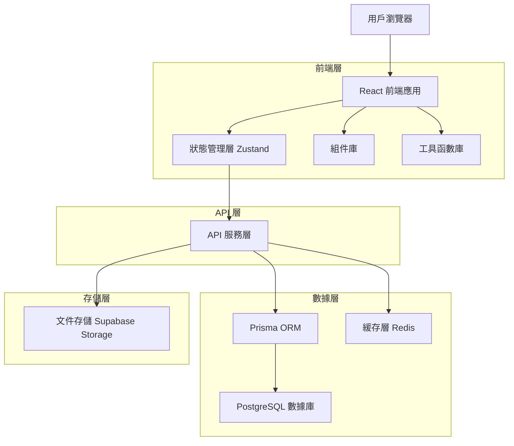
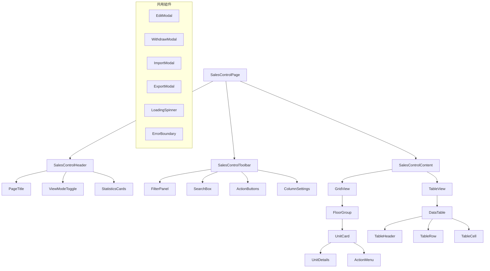
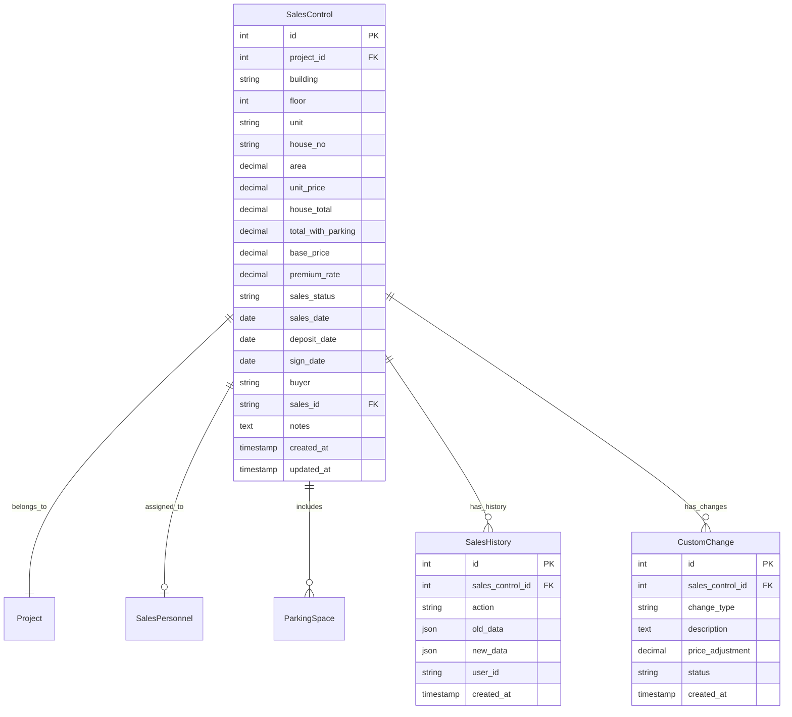

# 銷控管理頁面技術架構優化方案

## 1. 架構設計



## 2. 技術描述

**前端技術棧：**

* React\@18 + TypeScript\@5 + Next.js\@14

* 狀態管理：Zustand\@4 (替代當前的 useState)

* UI 組件：Ant Design\@5 + Tailwind CSS\@3

* 數據獲取：TanStack Query\@5 (React Query)

* 表單處理：React Hook Form\@7 + Zod\@3

* 圖表可視化：Recharts\@2

* 構建工具：Vite\@5 (可選升級)

**後端技術棧：**

* API 路由：Next.js API Routes

* ORM：Prisma\@5

* 數據庫：PostgreSQL (Supabase)

* 緩存：Redis (可選)

* 文件處理：Multer + Sharp

## 3. 路由定義

| 路由                                     | 用途                |
| -------------------------------------- | ----------------- |
| /project/\[id]/sales-control           | 銷控管理主頁面，支援網格和表格視圖 |
| /project/\[id]/sales-control/analytics | 銷售分析和報表頁面         |
| /project/\[id]/sales-control/settings  | 銷控設定和配置頁面         |
| /project/\[id]/sales-control/history   | 操作歷史記錄頁面          |

## 4. API 定義

### 4.1 核心 API

**銷控數據查詢**

```
GET /api/projects/[id]/sales-control
```

請求參數：

| 參數名稱        | 參數類型   | 是否必需  | 描述              |
| ----------- | ------ | ----- | --------------- |
| building    | string | false | 棟別篩選            |
| floor       | string | false | 樓層篩選            |
| salesStatus | string | false | 銷售狀況篩選          |
| salesPerson | string | false | 銷售人員篩選          |
| searchTerm  | string | false | 搜尋關鍵字           |
| page        | number | false | 頁碼 (默認 1)       |
| limit       | number | false | 每頁數量 (默認 50)    |
| sortBy      | string | false | 排序欄位            |
| sortOrder   | string | false | 排序方向 (asc/desc) |

響應：

| 參數名稱       | 參數類型                | 描述      |
| ---------- | ------------------- | ------- |
| data       | SalesControlData\[] | 銷控數據陣列  |
| total      | number              | 總記錄數    |
| page       | number              | 當前頁碼    |
| totalPages | number              | 總頁數     |
| hasMore    | boolean             | 是否有更多數據 |

**銷控數據更新**

```
PUT /api/projects/[id]/sales-control/[unitId]
```

請求體：

```json
{
  "buyer": "張三",
  "sales_status": "售出",
  "deposit_date": "2024-01-15",
  "sign_date": "2024-01-20",
  "unit_price": "850000",
  "sales_id": "EMP001",
  "custom_change": 1,
  "custom_change_content": "客廳加大",
  "notes": "VIP客戶"
}
```

**批量操作**

```
POST /api/projects/[id]/sales-control/batch
```

請求體：

```json
{
  "action": "update",
  "unitIds": [1, 2, 3],
  "data": {
    "sales_status": "訂金",
    "sales_id": "EMP002"
  }
}
```

**數據匯出**

```
GET /api/projects/[id]/sales-control/export
```

請求參數：

| 參數名稱    | 參數類型      | 是否必需  | 描述                   |
| ------- | --------- | ----- | -------------------- |
| format  | string    | true  | 匯出格式 (excel/csv/pdf) |
| columns | string\[] | false | 匯出欄位                 |
| filters | object    | false | 篩選條件                 |

**數據匯入**

```
POST /api/projects/[id]/sales-control/import
```

請求體：FormData 包含上傳的檔案

### 4.2 分析和報表 API

**銷售統計**

```
GET /api/projects/[id]/sales-control/statistics
```

響應：

```json
{
  "totalUnits": 120,
  "soldUnits": 85,
  "reservedUnits": 15,
  "availableUnits": 20,
  "salesRate": 70.8,
  "totalRevenue": 2550000000,
  "averagePrice": 30000000,
  "salesTrend": [
    {"month": "2024-01", "sold": 12, "revenue": 360000000},
    {"month": "2024-02", "sold": 15, "revenue": 450000000}
  ]
}
```

**銷售人員績效**

```
GET /api/projects/[id]/sales-control/performance
```

## 5. 組件架構設計



## 6. 狀態管理架構

**使用 Zustand 進行狀態管理：**

```typescript
// stores/salesControlStore.ts
interface SalesControlState {
  // 數據狀態
  data: SalesControlData[]
  loading: boolean
  error: string | null
  
  // 視圖狀態
  viewMode: 'grid' | 'table'
  filters: FilterOptions
  visibleColumns: string[]
  
  // 分頁狀態
  currentPage: number
  totalPages: number
  pageSize: number
  
  // 選擇狀態
  selectedUnits: number[]
  
  // 操作方法
  fetchData: () => Promise<void>
  updateUnit: (id: number, data: Partial<SalesControlData>) => Promise<void>
  setFilters: (filters: Partial<FilterOptions>) => void
  setViewMode: (mode: 'grid' | 'table') => void
  toggleColumnVisibility: (column: string) => void
  selectUnits: (ids: number[]) => void
  batchUpdate: (data: Partial<SalesControlData>) => Promise<void>
}
```

**使用 TanStack Query 進行數據獲取：**

```typescript
// hooks/useSalesControlData.ts
export function useSalesControlData(projectId: string, filters: FilterOptions) {
  return useQuery({
    queryKey: ['salesControl', projectId, filters],
    queryFn: () => fetchSalesControlData(projectId, filters),
    staleTime: 5 * 60 * 1000, // 5分鐘
    cacheTime: 10 * 60 * 1000, // 10分鐘
    refetchOnWindowFocus: false,
    retry: 3
  })
}
```

## 7. 數據模型

### 7.1 數據模型定義



### 7.2 數據定義語言

**銷控主表優化 (sales\_control)**

```sql
-- 添加索引優化查詢性能
CREATE INDEX idx_sales_control_project_building ON sales_control(project_id, building);
CREATE INDEX idx_sales_control_status ON sales_control(sales_status);
CREATE INDEX idx_sales_control_sales_person ON sales_control(sales_id);
CREATE INDEX idx_sales_control_dates ON sales_control(deposit_date, sign_date);

-- 添加全文搜索索引
CREATE INDEX idx_sales_control_search ON sales_control USING gin(to_tsvector('chinese', house_no || ' ' || buyer || ' ' || notes));
```

**操作歷史表 (sales\_history)**

```sql
CREATE TABLE sales_history (
    id UUID PRIMARY KEY DEFAULT gen_random_uuid(),
    sales_control_id INTEGER REFERENCES sales_control(id) ON DELETE CASCADE,
    action VARCHAR(50) NOT NULL,
    old_data JSONB,
    new_data JSONB,
    user_id VARCHAR(100) NOT NULL,
    ip_address INET,
    user_agent TEXT,
    created_at TIMESTAMP WITH TIME ZONE DEFAULT NOW()
);

CREATE INDEX idx_sales_history_sales_control ON sales_history(sales_control_id);
CREATE INDEX idx_sales_history_created_at ON sales_history(created_at DESC);
CREATE INDEX idx_sales_history_user ON sales_history(user_id);
```

**客變記錄表 (custom\_changes)**

```sql
CREATE TABLE custom_changes (
    id UUID PRIMARY KEY DEFAULT gen_random_uuid(),
    sales_control_id INTEGER REFERENCES sales_control(id) ON DELETE CASCADE,
    change_type VARCHAR(50) NOT NULL,
    description TEXT NOT NULL,
    price_adjustment DECIMAL(15,2) DEFAULT 0,
    status VARCHAR(20) DEFAULT 'pending' CHECK (status IN ('pending', 'approved', 'rejected', 'completed')),
    approved_by VARCHAR(100),
    approved_at TIMESTAMP WITH TIME ZONE,
    created_at TIMESTAMP WITH TIME ZONE DEFAULT NOW(),
    updated_at TIMESTAMP WITH TIME ZONE DEFAULT NOW()
);

CREATE INDEX idx_custom_changes_sales_control ON custom_changes(sales_control_id);
CREATE INDEX idx_custom_changes_status ON custom_changes(status);
```

**視圖設定表 (user\_view\_settings)**

```sql
CREATE TABLE user_view_settings (
    id UUID PRIMARY KEY DEFAULT gen_random_uuid(),
    user_id VARCHAR(100) NOT NULL,
    project_id INTEGER REFERENCES projects(id) ON DELETE CASCADE,
    view_mode VARCHAR(10) DEFAULT 'grid' CHECK (view_mode IN ('grid', 'table')),
    visible_columns JSONB DEFAULT '[]',
    filters JSONB DEFAULT '{}',
    sort_config JSONB DEFAULT '{}',
    created_at TIMESTAMP WITH TIME ZONE DEFAULT NOW(),
    updated_at TIMESTAMP WITH TIME ZONE DEFAULT NOW(),
    UNIQUE(user_id, project_id)
);
```

## 8. 性能優化策略

### 8.1 前端性能優化

**1. 組件優化**

```typescript
// 使用 React.memo 優化組件重渲染
const UnitCard = React.memo(({ unit, onEdit }: UnitCardProps) => {
  // 組件實現
})

// 使用 useMemo 優化計算
const filteredData = useMemo(() => {
  return data.filter(unit => {
    // 篩選邏輯
  })
}, [data, filters])

// 使用 useCallback 優化函數引用
const handleEdit = useCallback((unit: SalesControlData) => {
  // 編輯邏輯
}, [])
```

**2. 虛擬滾動實現**

```typescript
// 使用 react-window 實現虛擬滾動
import { FixedSizeList as List } from 'react-window'

const VirtualizedTable = ({ data }: { data: SalesControlData[] }) => {
  const Row = ({ index, style }: { index: number; style: React.CSSProperties }) => (
    <div style={style}>
      <TableRow data={data[index]} />
    </div>
  )
  
  return (
    <List
      height={600}
      itemCount={data.length}
      itemSize={60}
      width="100%"
    >
      {Row}
    </List>
  )
}
```

### 8.2 數據緩存策略

**1. 瀏覽器緩存**

```typescript
// 使用 IndexedDB 進行本地緩存
class SalesControlCache {
  private db: IDBDatabase | null = null
  
  async init() {
    // 初始化 IndexedDB
  }
  
  async set(key: string, data: any, ttl: number = 3600000) {
    // 設置緩存數據
  }
  
  async get(key: string) {
    // 獲取緩存數據
  }
}
```

**2. 服務端緩存**

```typescript
// API 路由中使用 Redis 緩存
export async function GET(request: Request) {
  const cacheKey = `sales-control:${projectId}:${JSON.stringify(filters)}`
  
  // 嘗試從緩存獲取
  const cached = await redis.get(cacheKey)
  if (cached) {
    return Response.json(JSON.parse(cached))
  }
  
  // 從數據庫查詢
  const data = await prisma.salesControl.findMany({
    // 查詢條件
  })
  
  // 設置緩存
  await redis.setex(cacheKey, 300, JSON.stringify(data)) // 5分鐘緩存
  
  return Response.json(data)
}
```

### 8.3 數據庫優化

**1. 查詢優化**

```sql
-- 使用複合索引優化常用查詢
CREATE INDEX idx_sales_control_composite ON sales_control(project_id, building, sales_status, sales_id);

-- 使用部分索引優化特定條件查詢
CREATE INDEX idx_sales_control_sold ON sales_control(project_id, deposit_date) WHERE sales_status = '售出';
```

**2. 分頁優化**

```typescript
// 使用游標分頁替代偏移分頁
export async function getSalesControlData({
  projectId,
  cursor,
  limit = 50,
  filters
}: {
  projectId: number
  cursor?: number
  limit?: number
  filters: FilterOptions
}) {
  const whereClause = {
    project_id: projectId,
    ...(cursor && { id: { gt: cursor } }),
    // 其他篩選條件
  }
  
  const data = await prisma.salesControl.findMany({
    where: whereClause,
    take: limit + 1, // 多取一條判斷是否有下一頁
    orderBy: { id: 'asc' }
  })
  
  const hasMore = data.length > limit
  if (hasMore) data.pop()
  
  return {
    data,
    hasMore,
    nextCursor: hasMore ? data[data.length - 1].id : null
  }
}
```

## 9. 安全性考慮

### 9.1 數據驗證

```typescript
// 使用 Zod 進行數據驗證
import { z } from 'zod'

const SalesControlUpdateSchema = z.object({
  buyer: z.string().max(100).optional(),
  sales_status: z.enum(['售出', '訂金', '未售出', '不銷售']).optional(),
  deposit_date: z.string().datetime().optional(),
  sign_date: z.string().datetime().optional(),
  unit_price: z.number().positive().optional(),
  notes: z.string().max(1000).optional()
})
```

### 9.2 權限控制

```typescript
// 基於角色的權限檢查
export async function checkPermission(userId: string, action: string, resourceId: number) {
  const user = await getUserWithRoles(userId)
  const permissions = await getPermissions(user.roles)
  
  return permissions.some(p => 
    p.action === action && 
    (p.resource === '*' || p.resource === resourceId.toString())
  )
}
```

## 10. 監控和日誌

### 10.1 性能監控

```typescript
// 使用 Web Vitals 監控前端性能
import { getCLS, getFID, getFCP, getLCP, getTTFB } from 'web-vitals'

function sendToAnalytics(metric: any) {
  // 發送性能數據到分析服務
}

getCLS(sendToAnalytics)
getFID(sendToAnalytics)
getFCP(sendToAnalytics)
getLCP(sendToAnalytics)
getTTFB(sendToAnalytics)
```

### 10.2 錯誤追蹤

```typescript
// 使用 Error Boundary 捕獲組件錯誤
class SalesControlErrorBoundary extends React.Component {
  componentDidCatch(error: Error, errorInfo: React.ErrorInfo) {
    // 記錄錯誤到監控服務
    console.error('SalesControl Error:', error, errorInfo)
  }
  
  render() {
    if (this.state.hasError) {
      return <ErrorFallback />
    }
    return this.props.children
  }
}
```

