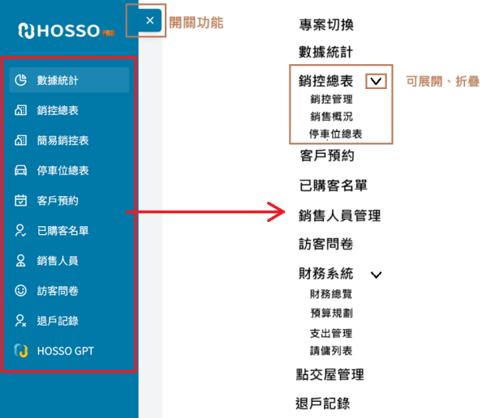
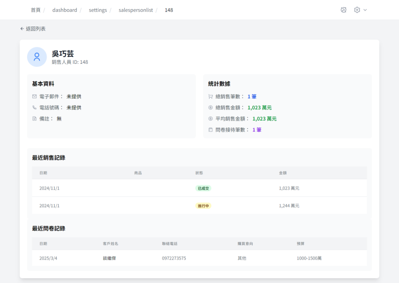

**銷售系統軟體規格******

<!--[if !supportLists]-->1.<!--[endif]-->**系統架構：******

前端：Next.js、Typescript、Tailwind、shadcn

中間層(API Server)：Next.js

資料庫：MySQL前端部屬環境：Vercel、自組PC後端部屬環境：自組PC

前端用戶介面文字需使用正體(繁體)中文

<!--[if !supportLists]-->2.<!--[endif]-->**網頁架構：******

<!--[if !supportLists]-->3.<!--[endif]-->**權限管理：******

用戶具有兩種權限：系統管理員、銷售人員系統管理員具有所有編輯與瀏覽權限銷售人員僅可瀏覽自己具備權限的建案，並只能編輯該建案自己賣出的戶型之相關資訊，包含該戶型的銷控表資訊、售出的車位資訊、該戶購屋客資訊、訂金管理、點交屋管理，不可使用Excel匯入功能。僅有系統管理員可設定建案戶型之銷售人員

<!--[if !supportLists]-->4.<!--[endif]-->**數據資料結構：******

請參考附件JSON檔

<!--[if !supportLists]-->5.<!--[endif]-->**網頁功能與介面：******

**所有行列式表單均須具備基本的項目排序功能******

**導覽列：******

**專案切換頁：******布局範例如上，+項目為新增建案功能，按下新增鍵會彈出浮窗要求輸入建案名稱與上傳一張建案主視覺圖每個項目框內的格式如下，背景為主視圖，中間建案名稱，當hover狀態時背景加上黑色半透明遮罩凸顯建案名稱

**數據統計：******

由資料庫中各種表單提取統計，須具備時間篩選與輸出成PDF下載的功能，PDF格式範例參考附件數據統計報表.pdf

****

各類統計資料格式如下⭡數據來源：銷控總表、訪客問卷⭡數據來源：銷售人員表

⭠數據來源：訪客問卷 

⭡數據來源：已購客名單

⭡數據來源：訪客問卷

⭡數據來源：退戶記錄

**銷控管理：******

銷控表單具備兩種模式，網格視圖、表視圖

⭣網格視圖

須具備Excel表匯入匯出功能，表格式參考附件：銷控表網格視圖表單匯入須具備預覽功能，確定資料匯入正確性

買方姓名右邊新增一個退戶按鈕，點擊後彈出確認退戶浮窗，確認後進入退戶程序，於退戶記錄新增一筆退戶資料並將該戶欄位資料回歸未售出狀態

⭣表單內容須可即時更改，點擊項目後即顯示修改框

項目格式類型如下買方姓名：string、不可修改，從買方資訊提取所有買家姓名，並以”,”隔開、買方姓名欄位佔一整行，右側會有退戶按鈕，點擊後資料進入退戶記錄，並清空現有紀錄恢復未售出狀態買方人數：number、下拉選單(選項：預設0\~5人)、修改後依照人數在買方資訊建立項目下訂日期：date、日期選項簽約日期：date、日期選項銷售狀況：string、下拉選單(選項：售出、訂金、不銷售、未售出)、**僅系統管理員可修改******車位價格：number、不可修改，通過車位號碼由停車位總表算出、單位(萬元)每坪單價：number、數字輸入、單位(萬元)銷售人員：string、下拉選單、由銷售人員表單取得，需過慮，僅顯示具有該建案權限的銷售人員房價：number、數字輸入、單位(萬元)客變需求：boolean、下拉選單(選項：是、否)，另可填寫客變內容坪數：number、數字輸入露臺坪數：number、數字輸入含車位總價：number、不可修改、由房價與車位價格自動加總車位號碼：string\[]、下拉選單、由停車位總表取得，不可選擇已被其他戶綁定 的車位，可複選⭢底價：number、數字輸入、單位(萬元)溢價率：number、不可修改、(每坪單價-底價)/底價贈送：string、文字輸入、佔一整行備註：string、文字輸入、佔一整行

⭣若該樓層此戶型不存在則顯示無資料

⭣表視圖

須具備Excel表匯入匯出功能，表格式參考附件：銷控表表視圖；可輸出成csv格式；具有欄位顯示開關功能⭢

每個項目亦須具備即時更改功能，詳細項目基本與網格視圖相同，並額外顯示下列項目：編號：number、不可修改、由最高樓層第一種房型依序排序房型編號：string、不可修改、原則上為樓層+戶別的組合客變內容：string、文字輸入媒體來源：string、文字輸入

**銷售概況：******

根據銷控表的銷售狀況欄位製成簡易銷售概況

********

**停車位總表：**

****

須具備新增、移除車位；Excel匯入匯出；CSV匯出；欄位顯示開關功能、部分欄位可修改新增車位：點擊新增車位後只需填寫車位編號即可新增車位移除車位：僅有未售出車位可被移除，點擊項目前方的X後跳出確認移除的提示，點擊確認後移除

各項目欄位的編輯功能如下：車位編號：string、不可更改車位類型：string、下拉選單、選項(平面、機械上層、機械中層、機械下層、機械平移、機車位、腳踏車位、自設、法定)價格：number、數字輸入、單位(萬元)銷售狀態：string、不可更改、來自於銷控總表中綁定的戶型之銷售狀態銷售日期：date、不可更改、來自於銷控總表中綁定的戶型之簽約日期買方：string、不可更改、來自於銷控總表中綁定的戶型之買方姓名銷售人員：string、不可更改、來自於銷控總表中綁定的戶型之銷售人員備註：string、文字輸入

**客戶預約：**

客戶預約的表分為月、週、日、列表四種介面，另有今天、本周、本月三個快速定位按鈕。右上角有日期調整與新增預約按鈕，點擊預約表日期或時間可帶入時間新增預約

 

新增預約表單格式如下：客戶姓名：string、文字輸入電話號碼：string、文字輸入、正則式(/^09\[0-9]{2}-\[0-9]{3}-\[0-9]{3}$|^09\[0-9]{2}\[0-9]{3}\[0-9]{3}$/)開始時間：date、時間選擇，最小單位為分鐘結束時間：date、時間選擇，最小單位為分鐘、時間範圍為開始時間後3小時為限接待人員：string、下拉選單，資料來自於銷售人員表單，僅顯示具備該建案權限之人員，若選定人員於該時間段已於系統內存在預約，則該人員會變為無法選擇的狀態備註：string、文字輸入狀態：string、下拉選單(選項：待確認、已確認、已取消)

**已購客名單：******

資料來源為銷控表已售出或付訂金戶型的買方資訊

具備CSV、Excel匯出；欄位顯示開關

項目

各項目欄位的編輯功能如下：姓名：string、文字輸入、與銷控表中的買方姓名為相同欄位房型編號：string、不可修改、來自於銷控表的房型編號購買日期：date、不可修改、來自於銷控表的簽約日期身分證字號：string、文字輸入法人買家：boolean、下拉選單(選項：是、否)電子郵件：string、文字輸入(電子郵件格式)連絡電話：string、文字輸入、正則式(/^09\[0-9]{2}-\[0-9]{3}-\[0-9]{3}$|^09\[0-9]{2}\[0-9]{3}\[0-9]{3}$/)年齡：number、數字輸入職業：string、文字輸入戶籍地址：string、文字輸入通訊地址：string、文字輸入備註：string、文字輸入評級：string、下拉選單(選項：S、A、B、C、D)

**銷售人員：******

銷售人員管理系統僅系統管理員具備新增與操作權限，其餘用戶僅可查看系統管理員看到的人員清單為總表，包含不具備該建案權限的銷售人員(項目背景底色用灰色)，其餘用戶看到的僅有具備該建案權限的銷售人員清單

⭣點擊銷售人員項目後可以查看該人員的相關資訊與統計資料資料來源基本資料：銷售人員資料表銷售紀錄：銷控表中銷售人員為該人員之戶型資料，日期對應簽約日期；商品對應房型編號；狀態對應銷售狀況；金額對應含車位總價問卷紀錄：訪客問卷中接待人員為該人員之問卷資料統計數據：根據上述紀錄統計出總銷售筆數、總銷售金額、平均銷售金額、問卷接待筆數

⭣點擊新增或編輯人員後進入人員設定表單上表僅為設計範例，實際表單填寫資料如下：員工編號：string、僅新增時可填寫、員工資料的主鍵姓名：string、文字輸入電子郵件：string、文字輸入(電子郵件格式)、將作為銷售人員登錄帳號密碼：string、文字輸入、將作為銷售人員登錄帳號電話號碼：string、文字輸入、正則式(/^09\[0-9]{2}-\[0-9]{3}-\[0-9]{3}$|^09\[0-9]{2}\[0-9]{3}\[0-9]{3}$/)銷售建案：string、下拉選單(選項內容為所有建案，可複選)，參考模式⭣備註：string、文字輸入

點擊刪除人員後會跳出確認刪除浮窗，確認後刪除，刪除人員不影響銷控表中已存在資料

**訪客問卷：******

具備CSV、Excel匯出；欄位顯示開關；新增項目功能

各項目欄位的編輯功能如下：問卷日期：date、不可修改，問卷建立時即鎖定姓名：string、文字輸入年齡：number、數字輸入性別：string、下拉選單(選項：男、女、不透露)市話：string、文字輸入(電話格式)手機：string、文字輸入、正則式(/^09\[0-9]{2}-\[0-9]{3}-\[0-9]{3}$|^09\[0-9]{2}\[0-9]{3}\[0-9]{3}$/)電子郵件：string、文字輸入(電子郵件格式)職業：string、下拉選單(選項後續提供)接待人員：string、下拉選單(銷售人員清單)參觀戶別：string、下拉選單(銷控表房型編號)購屋時程：string、下拉選單(選項：半年內、一年內、其他)需求類型：string、下拉選單(選項：結構體、成屋、預售屋)理想坪數：string、下拉選單(選項：21坪以下、21-30坪、31-40坪、41-50坪、51坪以上、其他)房數需求：string、下拉選單(選項：二房、三房、四房、店面、其他)預算區間：string、下拉選單(選項：1000-1500萬、1500-2000萬…5500-6000萬、6000萬以上、其他)購買考量：string\[]、多選(選項：後續補充)滿意因素：string\[]、多選(選項：後續補充)個人居住區域：string、文字輸入購買動機：string、下拉選單(選項：首購、換屋、投資置產、為子女購屋、其他)資訊來源：string、多選(選項：後續補充)評級：string、下拉選單(選項：S、A、B、C、D)新增按鈕：點擊後出現表單填寫浮窗，表單項目與上述相同，但問卷日期可自由選擇且為必填每個項目最後方新增一個移除按鈕，點擊並確認後移除該項目

**退戶分析表：******

資料來源為銷控表中的退戶記錄需有CSV與Excel匯出；欄位顯示開關各欄位設定如下：客戶姓名、棟別、樓層、戶號：來自銷控表、不可修改退戶狀態：string、下拉選單(選項：已申請、處理中、已完成、已取消)退戶原因：string、下拉選單(選項：後續補充)退戶日期：date、日期選擇房價、房屋單價、車位價格、含車位總價：點擊退戶時的該戶數據

**財務總覽：******

資料來源為預算規劃與支出管理表單

須具備時間設定過濾功能並呈現出如上圖的表單呈現出的統計數據為預算規劃中的所有類別

**預算規劃：******

須具備新增預算功能

預算規劃的各項欄位如下：類別：string、文字輸入細項：string、文字輸入預算：number、數字輸入實際支出：number、不可修改、由數量x單價自動得出數量：number、數字輸入單位：string、文字輸入單價：number、數字輸入廠商：string、文字輸入執行率：number、不可修改、由(實際支出/預算)%自動得出備註：string、文字輸入

**支出管理：******

須具備時間過濾；新增預算功能

支出管理的各項欄位如下：日期：date、日期選擇類別：string、下拉選單(選項：預算規劃中存在的支出類別)細項：string、文字輸入實際支出：number、不可輸入、數量x單價自動得出數量：number、數字輸入單位：string、文字輸入單價：number、數字輸入廠商：string、文字輸入發票號碼：string、文字輸入備註：string、文字輸入

**請傭列表：******

數據來源為銷控表中已售出的戶型

須具備時間過濾功能

此表單無法直接編輯，僅能新增、修改請傭紀錄請傭列表具有以下欄位：棟別、坪數、樓層、戶別、狀態、銷售員、銷售日期(簽約日期)、總價、含車位總價、請傭紀錄、請傭%數(每次請傭%總和)、請傭金額(含車位總價x請傭%數)

點擊請傭紀錄旁+號開啟請傭紀錄與設定，可新增、修改、移除該戶別請傭紀錄，每一筆請傭紀錄具備3個項目：傭金比例：number、數字輸入請傭狀態：string、下拉選單(選項：已請傭、未請傭)請傭金額：number、不可修改、由含車位總價x傭金比例得出

**訂金管理：******

數據來源為銷控表中的訂金管理

需有樓層過濾與視圖切換功能

訂金管理的各項欄位如下：買方姓名：不可編輯訂金金額：number、數字輸入付款狀態：string、下拉選單(選項：已結清、部分付款、未付款、逾期)付款日期：date、日期選擇，與銷控表的下訂日期為同一項目付款到期日：date、日期選擇自動提醒：boolean、下拉選單(選項：開、關)、自動提醒右邊需有發送通知按鈕備註：string、文字輸入

**點交屋管理：******

 需有樓層過濾與視圖切換功能

 點交屋管理的各項欄位如下：買方姓名：string、不可編輯、來自於銷控表點交紀錄：string、下拉選單、用於選擇第幾次點交，選擇後下方資訊會帶入該次點交的資料、欄位右側+按鈕開啟編輯視窗，可用於新增、修改點交資料⭣點交日期：date、日期選擇負責工務：string、文字輸入房子屋況：string、下拉選單(選項：正常、待修)現況照片：img\[]、點擊查看跳出浮窗，可參考下圖，多張圖片可切換顯示⭣點擊上傳出現檔案上傳介面並可將圖片上傳至資料庫，點擊編輯可調整圖片排序與移除圖片，圖片刪除需有確認提示簽名：file\[]、原則上簽名為PDF文件，點擊查看會在浮窗中顯示已上傳的PDF清單及連結，點擊上傳出現檔案上傳介面並可將檔案上傳至資料庫，點擊編輯可調整檔案排序與移除檔案，檔案刪除需有確認提示備註：string、文字輸入

<!--EndFragment-->
